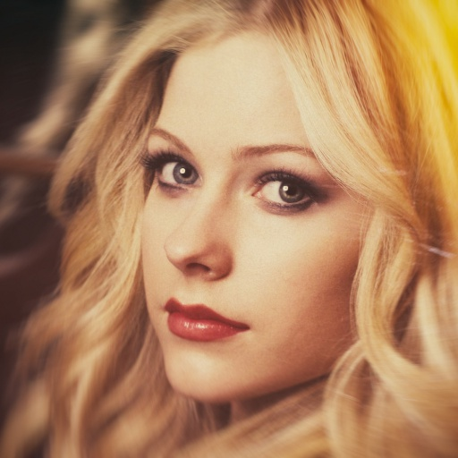
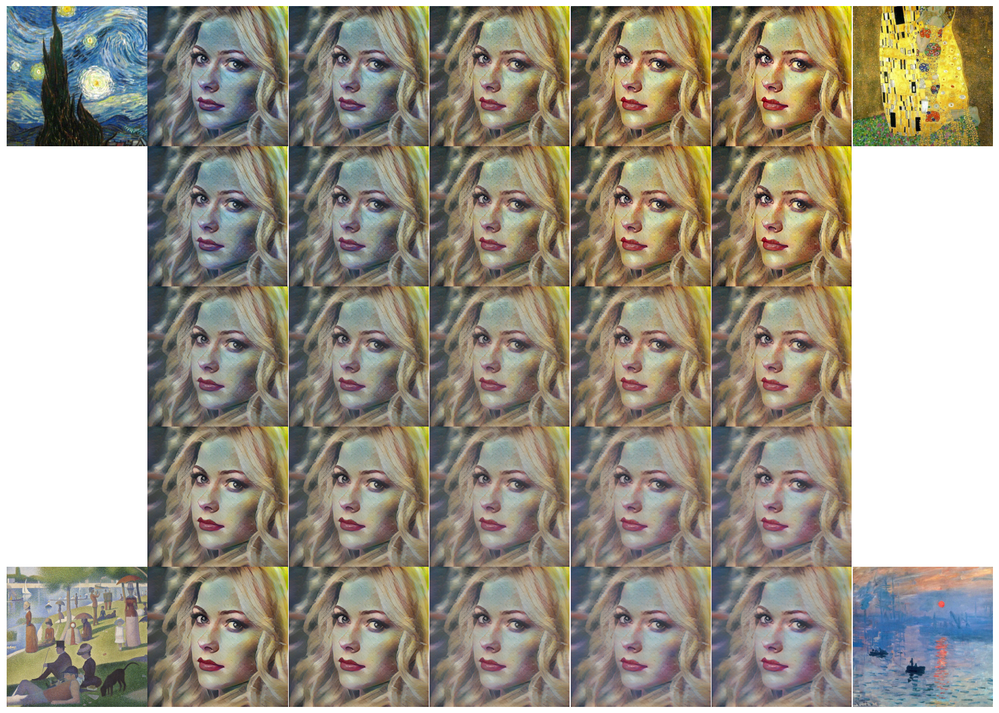

# Style Transfer in Real-time

This project implements real-time arbitrary style transfer using **Adaptive Instance Normalization (AdaIN)**, inspired by [Arbitrary Style Transfer in Real-time with Adaptive Instance Normalization](https://arxiv.org/abs/1703.06868). The AdaIN layer, similar to instance normalization, combines the content of one image with the style of another in real time.

## Examples

<p align='center'>
  
  
  
  
  
  
</p>

## How It Works

<p align='center'>
  
</p>

1. **VGG-19 Encoder**: Extracts features from content and style images using a pre-trained VGG-19 model.
2. **AdaIN**: Aligns the mean and standard deviation of content features to match the style features.
3. **Decoder**: Reconstructs the stylized image, preserving content structure with the style applied.

This approach enables fast, flexible, and training-free style transfer for inference, with optional training for the decoder.

**Supported Workflows**:
- **Training**: Train the decoder network (dataset required).
- **Inference**: Apply the trained model for real-time style transfer.

## Training and Dataset

- **Kaggle Notebook**: [Style Transfer in Real Time](https://www.kaggle.com/code/mohamedmohiey/adain-style-transfer-vgg19)
- **Dataset**: [Style Transfer Dataset](https://www.kaggle.com/datasets/mohamedmohiey/style-transfer)

## Requirements

- Python 3.13
- PyTorch & torchvision (see `requirements.txt`)

## Installation

Clone the repository and install dependencies:

```bash
git clone https://github.com/mohiey-507/style-transfer-in-real-time
cd style-transfer
pip install -r requirements.txt
```

## Usage

Basic usage involves providing paths to content and style images:

```bash
python3 scripts/run.py -content examples/woman_with_hat/cornell.jpg -style examples/woman_with_hat/woman_with_hat.jpg
```

### Additional Options

Run `scripts/run.py --help` to see all available options, such as output filename or device selection (CPU/GPU).

#### Content-Style Trade-off

Adjust the stylization degree with `-alpha` (default: 1, range: 0 to 1):

```bash
python3 scripts/run.py -content examples/content_style_alpha/chicago.jpg -style examples/content_style_alpha/ashville.jpg -alpha 0.5
```

<p align='center'>
  
</p>

#### Style Interpolation

Interpolate between multiple styles using `-interp_weight`:

```bash
python3 scripts/run.py -content examples/arvil/avril.jpg -style examples/style_interpolation/the_starry_night.png examples/style_interpolation/gustav_klimt_the_kiss.png -interp_weight 0.2 0.8
```

<p align='center'>
  
</p>

## Contributing

Contributions are welcome! To contribute:
- Submit pull requests with clear descriptions of changes.
- Report bugs or suggest features by opening an issue.
- Follow the project's coding style and include tests where applicable.

## Reference

Xun Huang and Serge Belongie, "Arbitrary Style Transfer in Real-time with Adaptive Instance Normalization," 2017. [arXiv:1703.06868](https://arxiv.org/abs/1703.06868).